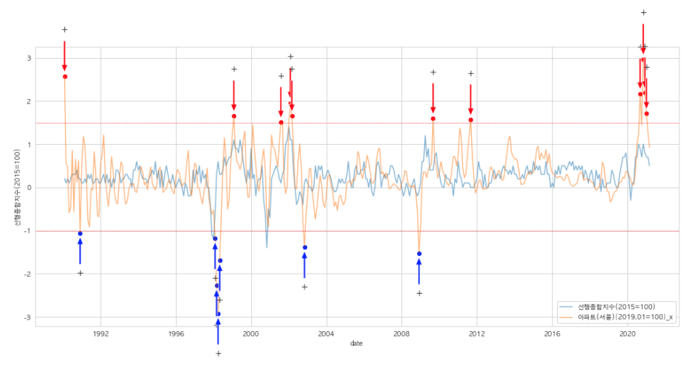

# 경기선행지수와 부동산 데이터로 살펴본 한국 경제

---

Table of Contents

---

# 1. 경기종합지수(Composite Economic Indexes) 란?

우리나라의 경기종합지수는 선행종합지수, 동행종합지수, 후행종합지수 3개가 작성되고 있으며, 기준년도 수치가 100(예, 2015=100)이 되도록 하여 산출하고 있다. 

매월 통계청에서 19개(선행 7개, 동행 7개, 후행 5개) 구성지표의 자료를 수집하고 이를 가공ㆍ종합하여 작성ㆍ공표한다. 

- **선행종합지수**

    : 선행종합지수는 건설수주, 재고순환, 경제심리지수 등의 지표처럼 실제 경기순환에 앞서 변동하는 개별지표를 가공ㆍ종합하여 만든 지수로 향후 경기변동의 단기 예측에 이용된다. 

- **선행종합지수 구성지표**

    1. 재고순환지표

    2. 경제심리지수

    3. 건설수주액(실질)

    4. 기계류내수출하지수(선박제외)

    5. 수출입물가비율

    6. 코스피

    7. 장단기금리차

---

# 2. 우리가 가진 데이터 중 가장 선행종합지수와 상관도가 높은 데이터는?

건설수주액과 경기선행지수간의 상관계수 히트맵

모든 데이터들과 경기선행지수간의 상관계수 히트맵

선행종합지수와 가장 높은 변수 TOP9

## 경기선행지수와 서울 아파트 주택전세가격지수(KB)가 가장 상관계수가 높았다.

- 모든 데이터를 통해서 상관계수를 추출했을 때, 미미한 차이였지만 주택전세가격지수(서울 아파트)가 약 0.986으로 경기선행지수와 가장 높은 상관 관계를 보였다.
- 대한민국 인구의 절반이 서울과 수도권에 모여있고, 서울 아파트가 가장 거래량, 공급량에서 차지하는 비율이 높을 것이라 추측할 수 있고, 그에 따라 경기 순환지표에 높은 영향을 줄 것으로 추론된다.

---

# 3. 선행종합지수는 정말 선행하여 움직이는가?

## 선행종합지수와 부동산 지수들 간의 선행관계

- 주택전세가격지수들은 모두 비슷한 패턴을 보인다.  모두를 비교할 순 없으니 가장 상관관계가 높은 서울 아파트 전세값과 선행종합지수 간의 선행/후행 관계를 더 자세히 살펴보기로 한다.

상관계수가 높은 TOP5 변수들과 선행종합지수의 라인 차트

선행종합지수(푸른색)과 서울 아파트 주택전세지수(주황색)의 차분값 라인차트

- 전세 지수는 지속해서 상승하는 양상을 보이니, 변동 값을 보기 힘들다. "부동산 지수가 움직이기 전에, 선행지수가 먼저 움직이는지 보려면, 변동성을 봐야 한다."는 전제 하에 지수들의 차분값(Difference)을 살펴보기로 한다.
- 차분 값의 급격한 변동이 있었던 시점에서, 실제로 '그 전에 선행지수가 동일한 방향으로 움직였는가?'를 보고자 한다.

### 1998년 3월~5월

> "국제통화기금(IMF) 한파의 영향으로 주택건설업체들의 부도가 꼬리를 물고 있는데다 분양시장은 고금리와 소비자들의 심리적 위축 영향으로 마비현상이 갈수록 심화"

- [*<확대경> 주택공급 부족 대란 오나*](https://news.naver.com/main/read.nhn?mode=LSD&mid=sec&sid1=101&oid=001&aid=0004373801)

1998년 1월~4월 사이에 본격적으로 전세지수가 떨어지기 전에, 약 3개월 앞선 1997년 10월부터 선행지수가 하락하기 시작한다.

2000년 12월까지 전세가격지수가 하락하기 전에도, 1개월 앞서 선행지수가 움직였다.

### 2000년 11월

> "지난 6월 넷째주 이후 처음으로 하락세로 돌아선 것이다.
전세가가 오를대로 오른데다 수요도 줄어든데 따른 것으로 분석된다. 중소형 아파트비중이 상대적으로 많은 관악 금천 구로 광진 성북 중랑구 등의전세가격이 약세를 보였다."

- [*서울 전세價 '주춤;...매매價 덩달아 약세*](https://news.naver.com/main/read.nhn?mode=LSD&mid=sec&sid1=101&oid=015&aid=0000285899)

---

# 4. 2021년은 어떻게 될까?

선행종합지수와 서울 아파트 주택전세지수의 차분값(변동성)은 2020년 말 크게 뛰었다가 하락추세인 것으로 보인다.

ARIMA모델의 향후 5개월 예측 값은 유지 상태인 것 처럼 보이나, 실제 마지막 5개월 상승폭은 하락하고 있다.

### 원인1. 2020년 7월 임대차 3법 시행의 파장

- 세입자에게 1회의 계약갱신요구권을 보장해 현행 2년에서 4년(2+2)으로 계약 연장을 보장한다.
- 전월세상한제는 임대료 상승폭을 직전 계약 임대료의 5% 내로 하되, 지자체가 조례로 상한을 정할 수 있도록 했다.
- 이에 따라 2021년 6월 1일부터는 전월세 거래 등 주택 임대차 계약 시 임대차 계약 당사자(집주인과 세입자)가 30일 이내에 주택 소재지 관청에 임대차 보증금 등 임대차 계약 정보를 신고해야 한다. 만약 당사자 중 일방이 신고를 거부하면 단독으로 신고할 수 있도록 했으며, 임대차 신고가 이뤄지면 확정일자를 부여한 것으로 간주된다.
- 참고1 : [*임대차 3법*](https://terms.naver.com/entry.naver?docId=5960413&cid=43667&categoryId=43667)
- 참고2 : [*임대차 3법 파장 ‘2+2년 계약 연장’ ‘5% 상한’ 의무화*](https://news.mk.co.kr/v2/economy/view.php?year=2020&no=791946)

### 원인2. 계절적 비수기

> 전셋값 상승률은 최근 둔화되는 추세다. KB부동산이 조사한 이번달 서울 아파트 전세가격 상승률은 전월 대비 0.80%로, 지난해 11월(2.77%) 이후 4개월 연속 상승폭이 줄어들었다. 이번달 강남구 아파트 전세가격지수는 0.01% 하락해 2019년 7월(-0.02%) 이후 20개월 만에 하락전환했다. 학군 배정 등 이사수요가 마무리되면서 고가 전세 중심으로 매물이 쌓이기 시작한 것으로 풀이된다.

- [*서울 아파트 평균 전셋값 6억 돌파…3년 전 평균 매매가 수준*](https://www.hankyung.com/realestate/article/202103295906i)

## 결론 : 증가폭의 약한 감소세가 예상된다.

- 선행종합지수의 차분값은 양의 값(상승)을 유지하면서 아주 작은 폭으로 감소세에 있으며, 이에 따라 6~7월까지는 서울 아파트 전세매매가격지수도 증가세가 감소할 것으로 전망된다.
- 2020년 7월, 임대차 3법이 시행되면서, 계약갱신 요구권 보장에 따라 세입자들은 두배(2년+2년)로 계약 연장을 보장받게 되었고, 임대료 상승폭은 5%로 제한되었다. 일각에서는 "전월세상한제 등 임대 시장에 대한 규제가 강해지면 전월세 공급량이 감소하는 등 시장이 불안해질 가능성이 크고 결국 애꿎은 세입자에게 피해가 돌아갈 것"이라는 전망도 보인다.

> "지난해 8월(5억1011만원) 5억원 선을 돌파한 뒤 불과 7개월만에 앞자리 수를 갈아치웠다. 지난해 3월(4억8393만원)과 비교해 1년 만에 약 25%(1억2170만원) 급등했다. 다만 전셋값 상승률은 최근 둔화되는 추세다. (...) 서울 아파트 전세가격 상승률은 전월 대비 0.80%로, 지난해 11월(2.77%) 이후 4개월 연속 상승폭이 줄어들었다."

- [*서울 아파트 전셋값 6억 돌파…임대차법 7개월만에 1억 상승*](https://www.dailian.co.kr/news/view/977107/?sc=Naver)